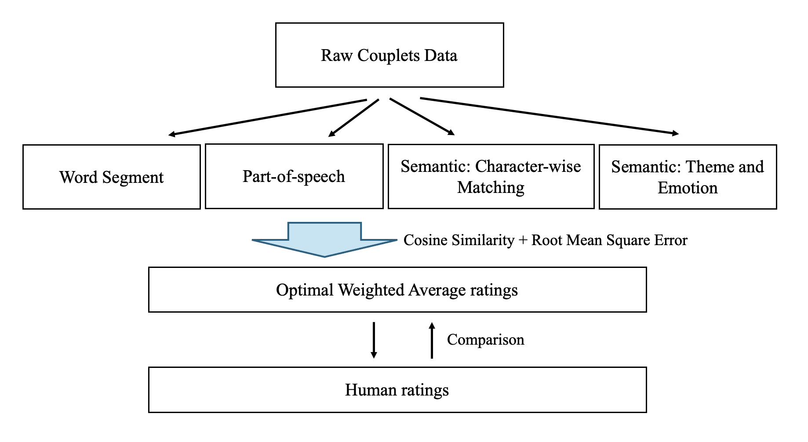
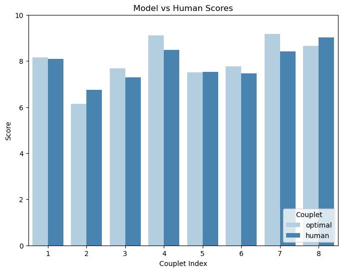

# Couplet Parallelism Measurement using Deep Learning

## 📖 Overview
This project models human evaluation of the **parallelism** in 7-character classical Chinese couplets using **deep learning techniques**. Parallelism is a key literary feature of Chinese couplets, encompassing syntactic, semantic, and thematic alignment between two poetic lines. Our goal is to develop a model that imitates human judgment of parallelism, providing insights into how this complex literary art is perceived.

## 🛠 Methodology

We implemented a framework that combines multiple computational models to evaluate couplet parallelism:
1. **Word Segmentation**:
   - Splits text into meaningful words for precise alignment.
   - Uses a feed-forward neural network with [**SikuBERT**](https://github.com/hsc748NLP/SikuBERT-for-digital-humanities-and-classical-Chinese-information-processing) embeddings for segmentation.
   
2. **Part-of-Speech (POS) Tagging**:
   - Identifies grammatical structures to compare syntactic alignment.
   - Utilizes a fine-tuned [**RoBERTa**](https://huggingface.co/KoichiYasuoka/roberta-classical-chinese-large-upos) model for POS tagging.

3. **Character-Wise Semantic Matching**:
   - Measures semantic similarity between corresponding characters in the two couplet halves.
   - Employs SikuBERT embeddings for comparison.

4. **Theme & Emotion Semantic Matching**:
   - Evaluates thematic and emotional alignment between couplet lines.
   - Leverages fine-tuned SikuBERT embeddings trained on a labeled classical poetry dataset.

### Weighted Average Scoring
The parallelism score is computed as a **weighted average** of the outputs from the above models. We optimized the weights using **Root Mean Square Error (RMSE)** to align model predictions with human-assigned scores.

### Comparison with Human Ratings
By designing a questionaire with 8 selected couplets, we collected parallelism scores from human participants to make comparison with our model output to check whether our model imitate human perception

## 📊 Dataset
- **Couplets Dataset**:
  - Cleaned dataset of ~350,000 7-character couplets.
  - Filtered from the original dataset on [GitHub](https://github.com/v-zich/couplet-clean-dataset).

- **Classical Poetry Dataset**:
  - Sourced from Kaggle, containing 17,103 poems with theme and emotion labels.
  - Useful for training the Theme & Emotion Semantic Matching model.

- **Human Survey**:
  - Conducted a survey with 151 participants of diverse demographics.
  - Collected human ratings for parallelism across eight carefully curated couplets.

## 🧠 Results

- The final model achieved a high degree of alignment with human scores, especially for **featureless couplets**.
- Key findings:
  - **Theme and emotion** play a significant role in human evaluation of parallelism.
  - The model struggles with classical allusions and cultural references, areas where human cognition excels.

## 📜 Files in this GitHub Page
- **Couplet_Data_Process.ipynb**:
  - Applied [Language Technology Platform (LTP) package](https://github.com/HIT-SCIR/ltp) to mass-label the raw Chinese text for word segmentation and POS tagging training.
- **Roberta.ipynb**:
  - Fine-tuned RoBERTa model to do POS tagging.
- **data_process_for_word_segmentation.ipynb**:
  - Further process of the dataset output from **Couplet_Data_Process.ipynb** for word segmentation model training.
- **word_segmentation.ipynb**:
  - Fine-tuned SikuBERT model to do word segmentation.
- **Semantic.ipynb**:
  - 
- **Theme and Rmotion.ipynb**:
  - 
- **weightsOptimization.ipynb**:
  - Optimized weights using RMSE to compute the final model output of parallelism score.

